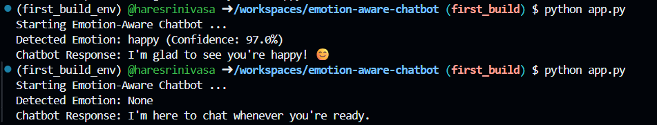
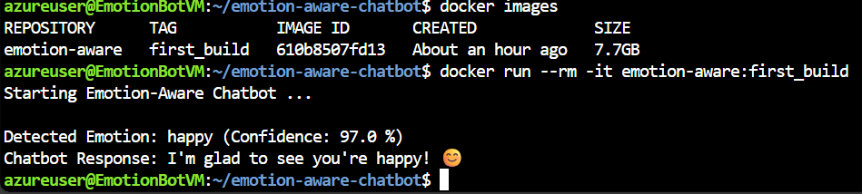

# 🤖 Emotion-Aware Chatbot

A real-time, webcam-integrated chatbot that detects human emotions using facial expressions 
and responds **empathetically**. This project combines computer vision, deep learning, and 
natural language processing to create a more emotionally intelligent conversational experience.

---

## 💡 Project Overview

This Emotion-Aware Chatbot captures a user's facial expression via webcam, detects their emotional state using a pre-trained deep learning model, and generates a contextually appropriate response. It's designed to demonstrate how AI can be used to build emotionally responsive systems, with potential applications in mental health support, customer service, and human-computer interaction.

---

## 🎯 Key Features

- 📷 **Webcam Integration**: Captures real-time facial images.
- 🤖 **Emotion Detection**: Uses the `FER` (Facial Expression Recognition) library with MTCNN for accurate emotion classification.
- 💬 **Empathetic Responses**: Generates human-like responses tailored to the detected emotion.
- 🧩 **Modular Design**: Clean separation of concerns across camera, emotion detection, and chatbot logic.

## 🛠️ Tech Stack

- **Language**: Python 3.11
- **Libraries**:
  - `OpenCV` – for webcam access and image capture
  - `FER` – for facial emotion recognition
  - `TensorFlow` – backend for emotion detection model
  - `Keras` – model loading and inference
- **Environment**: Virtualenv / VS Code Dev Container

---

## 🧠 How It Works
1. **Capture**: The webcam captures a live image when the user presses q.

2. **Detect**: The image is passed to the FER model to identify the dominant emotion.

3. **Respond**: A chatbot message is generated based on the detected emotion.

---

## 🔄 Version History

- **First Build**: 
  - CLI based application where static image was loaded to test the FER Model capabilities.

- **Second Build**: 
  - Simple Web interface where webcam of the user is used and real time emotion is captured!

---
## 📌 Example Output
<details>
  <summary><strong>FIRST BUILD</strong></summary>
  <br> On Local <br>
  <br> On Azure  <br>
</details> <br>
<details>
  <summary><strong>SECOND BUILD</strong></summary>
  <br> On Local <br>
  <br>
  <pre>
  🔁 Flow Summary
  [User] → clicks "Capture Emotion"
    ↓
  [Frontend JS] → captures webcam frame → converts to base64 → sends to backend
    ↓
  [Backend] → decodes image → detects emotion → generates response
    ↓
  [Frontend] → displays emotion, confidence, and chatbot reply
  </pre>
</details>

---

## 📁 Project Structure
<details>
  <summary><strong>FIRST BUILD</strong></summary>
  <pre>
  📁 emotion-aware-chatbot/
  ├── 📂 .devcontainer/              # ⚙️ Dev container setup for GitHub Codespaces or VS Code
  │   └── 📄 devcontainer.json       #    - Defines the container environment
  │
  ├── 📂 camera/                     # 📸 Webcam utilities
  │   └── 📄 webcam.py               #    - Captures live video and extracts facial images
  │
  ├── 📂 chatbot/                    # 🤖 Chatbot logic
  │   └── 📄 empathetic_bot.py       #    - Returns emotion-specific responses
  │
  ├── 📂 emotion/                    # 😶 Emotion detection module
  │   └── 📄 emotion_detector.py     #    - Uses FER to detect emotions from facial images
  │
  ├── 📄 app.py                      # 🚀 Main entry point that ties all modules together
  ├── 📄 Dockerfile                  # 🐳 Docker configuration for containerizing the app
  ├── 📄 requirements.txt            # 📦 Python dependencies
  ├── 📄 .gitignore                  # 🚫 Git ignore rules
  ├── 📄 .dockerignore               # 🚫 Docker ignore rules
  └── 📄 README.md                   # 📘 Project documentation (you are reading this now 😜)
  </pre>
</details>
<br>
<details>
  <summary><strong>SECOND BUILD</strong></summary>
  <pre>
  📁 emotion-aware-chatbot/
  ├── 📂 backend/                   # 🔗 Integration logic
  │   └── 📄 integration.py         #    - Connects webcam, emotion detection, and chatbot
  │
  ├── 📂 camera/                    # 📸 Webcam utilities
  │   └── 📄 webcam.py              #    - Decodes base64 webcam images
  │
  ├── 📂 emotion/                   # 😶 Emotion detection module
  │   └── 📄 emotion_detector.py    #    - Detects emotions using FER or ML model
  │
  ├── 📂 chatbot/                   # 🤖 Chatbot logic
  │   └── 📄 empathetic_bot.py      #    - Returns emotion-specific responses
  │
  ├── 📂 docs/                      # 🌐 Frontend assets
  │   ├── 📄 index.html             #    - Refactored with Material Web Components
  │   ├── 📄 style.css              #    - Material Design-inspired styling
  │   └── 📄 script.js              #    - Webcam capture and backend communication
  │
  ├── 📄 app.py                     # 🚀 Flask app entry point
  ├── 📄 Dockerfile                 # 🐳 Docker configuration
  ├── 📄 requirements.txt           # 📦 Python dependencies
  ├── 📄 .gitignore                 # 🚫 Git ignore rules
  ├── 📄 .dockerignore              # 🚫 Docker ignore rules
  └── 📄 README.md                  # 📘 Project documentation (you are reading this now 😜)
  </pre>
</details>

---

## 🚀 Getting Started
### 🐳 Recommended: Run with Docker
<details> 
<summary><strong>View Steps</strong></summary> 
<br> 

```bash
### 1. Clone the repository
git clone https://github.com/haresrinivasa/emotion-aware-chatbot.git
cd emotion-aware-chatbot

### 2. Build the Docker image
docker build -t emotion-aware .

### 3. Run the application
docker run -it --rm emotion-aware
```
</details>

### 🛠️ Optional: Run Locally Without Docker
<details> 
<summary><strong>View Steps</strong></summary> 
<br> 

``` bash
# 1. Create and activate a virtual environment
python -m venv first_build_env
source first_build_env/bin/activate  # On Windows: first_build_env\Scripts\activate

# 2. Install dependencies
pip install -r requirements.txt

# 3. Install system dependencies (Linux only)
sudo apt-get update && sudo apt-get install -y libgl1
sudo apt update
sudo apt install git-lfs
git lfs install

# 4. Run the application
python app.py
```
</details>

---

## 📫 Developer Contact
balaji27venkatesh@gmail.com
